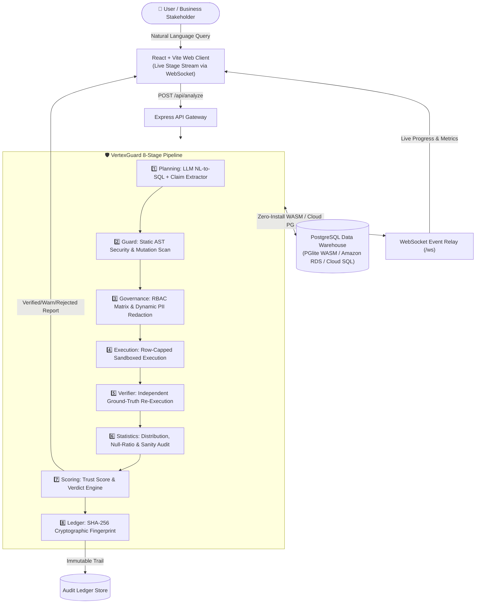
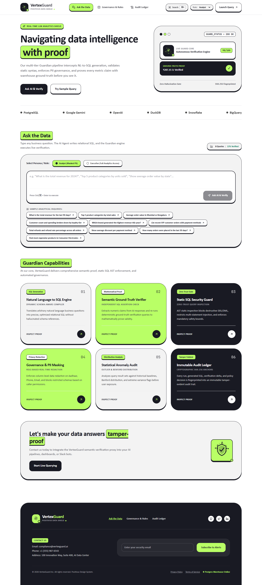
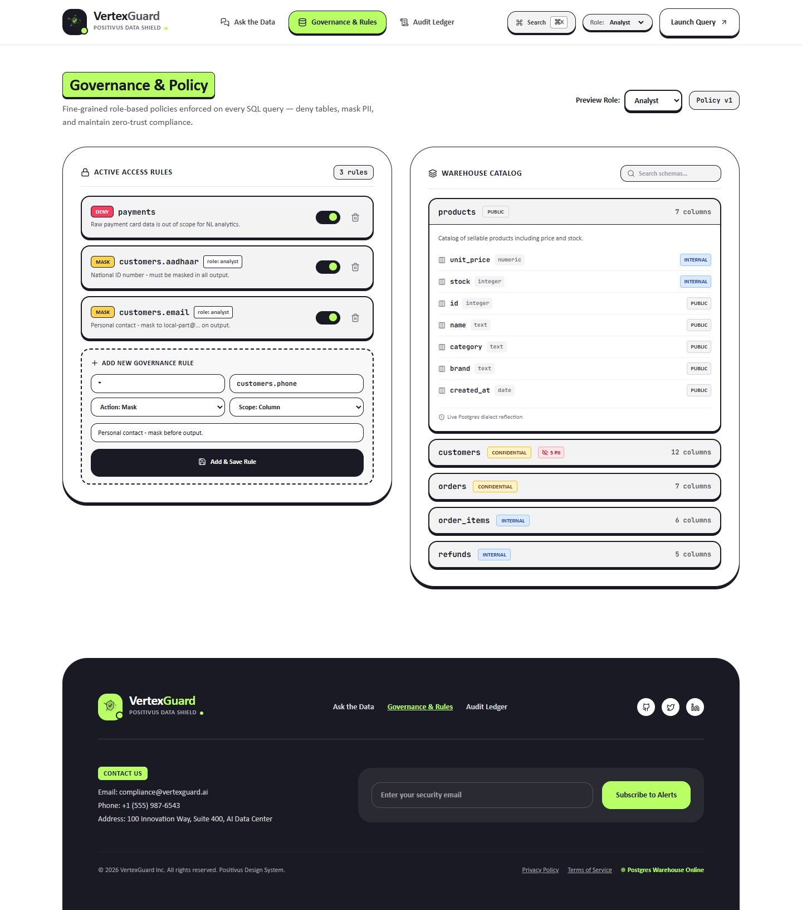
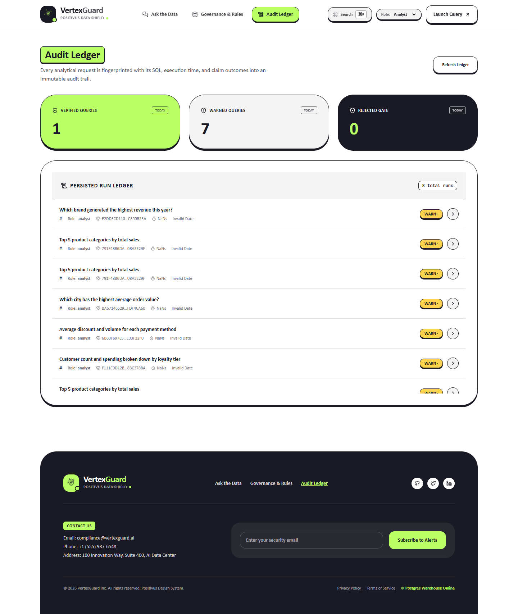

<div align="center">

# 🛡️ VertexGuard
### **Trusted Data Intelligence & Autonomous Semantic Governance Engine**

*Real-Time Semantic Verification • Statistical Audit • RBAC & PII Masking • SHA-256 Immutable Audit Trail*

---

[](https://vitejs.dev/)
[](https://react.dev/)
[](https://www.typescriptlang.org/)
[](https://nodejs.org/)
[](https://pglite.dev/)
[](https://tailwindcss.com/)
[](LICENSE)

[Live Demo](#-quick-start) • [Architecture](#-system-architecture) • [8-Stage Pipeline](#-the-8-stage-guardian-pipeline) • [Features](#-core-capabilities) • [Screenshots](#-visual-walkthrough--screenshots) • [API Docs](#-api-specification)

</div>

---

##  Executive Summary

Enterprise adoption of **Natural Language to SQL (NL-to-SQL)** and **GenAI Data Assistants** fails for two primary reasons:

1.  **The Silent Failure Trap:** Large Language Models produce *confident, plausible-looking* numbers that are subtly wrong (e.g., cancelled order leaks, refund double-counts, wrong date windows, and unit mismatch bugs). Because the SQL executes without syntax errors, executives make million-dollar decisions on corrupted data.
2.  **The Data Governance Trap:** Generative models lack granular data boundary awareness, freely exposing raw customer PII (Emails, Phone Numbers, Aadhaar/SSN) or querying restricted financial and payment tables.

**VertexGuard** eliminates both risks by placing an **autonomous 8-stage verification shield** between natural language prompts and data consumers. Every answer is **semantically verified against independent ground truth**, **statistically audited for anomalies**, **scanned for governance violations**, and sealed with a **cryptographic SHA-256 audit anchor**.

---

##  System Architecture



---

##  The 8-Stage Guardian Pipeline

| Stage | Name | Description & Action | Failure Protection |
| :---: | :--- | :--- | :--- |
| **1** | **Planning** | Generates candidate SQL query and extracts all explicit metric claims. | Unstructured ambiguity |
| **2** | **AST Guard** | Static AST security scan using `node-sql-parser` to block data mutations (`DROP`, `DELETE`, `UPDATE`) and unknown tables. | SQL Injection & Data Destruction |
| **3** | **Governance** | Evaluates role permissions (`Analyst` vs `Executive`) and applies PII redaction (regex & column masking). | PII / Compliance Violations |
| **4** | **Execution** | Executes sanitized query on PostgreSQL with row capping and query timeouts. | Unbounded scans / DoS |
| **5** | **Semantic Verifier** | **Recomputes every claim using independent, isolated ground-truth SQL.** | LLM Hallucinations & Metric Drift |
| **6** | **Statistical Audit** | Computes null-ratios, duplicate rates, and part-vs-whole sanity checks. | Distributional anomalies |
| **7** | **Scoring & Verdict** | Computes composite **Trust Score (0–100)** and issues verdict: `VERIFIED`, `WARN`, or `REJECTED`. | False confidence |
| **8** | **Audit Persistence** | Computes immutable **SHA-256 cryptographic hash** of prompt, SQL, and verdict ledger. | Audit non-compliance |

---

##  Trust Scoring Formula

$$\text{Base Score} = \max(0,\, 100 - 30 \times N_{\text{critical}} - 10 \times N_{\text{warnings}})$$

$$\text{Bonus} = +6 \quad \text{if all claims pass independent verification}$$

- 🟢 **`VERIFIED`**: Trust Score $\ge 92$ **AND** 100% ground-truth semantic verification pass.
- 🟡 **`WARN`**: Minor statistical warnings, non-critical anomalies, or non-redacted low-sensitivity fields.
- 🔴 **`REJECTED`**: Any critical AST violation, policy denial, or semantic ground-truth delta ($>0.5\%$).

---

##  Core Capabilities

### 1.  Independent Semantic Verification
Models are often confident when wrong. VertexGuard never relies on LLM self-confidence. Instead, an independent verifier runs orthogonal SQL queries against the raw warehouse tables to verify every quantitative claim made in the natural language summary.

### 2.  Role-Based Governance & Automated PII Masking
- **Analyst Persona:** Access to granular operational metrics with automatic masking for emails, phone numbers, and identity numbers.
- **Executive Persona:** Aggregated executive dashboards with restricted access to low-level raw customer tables.
- **Dynamic PII Masking:** Regex-driven redaction for Aadhaar, SSN, Credit Cards, and Email addresses.

### 3.  Production Failure Taxonomy Replay
Built-in deterministic test suite simulating real-world enterprise LLM failure modes:
- **Syndrome A (Unit Multiplier Error):** Catches $\times 10$ quantity bugs ($\Delta 900\%$).
- **Syndrome B (Cancelled Order Leak):** Flags missing `status != 'cancelled'` filters.
- **Syndrome C (Refund Double Count):** Detects gross vs net revenue accounting errors.
- **Syndrome D (Date Window Shift):** Flags off-by-one month/quarter bounds.
- **Syndrome E (Aggregation Swap):** Catches `AVG` vs `SUM` vs `COUNT(DISTINCT)` substitutions.
- **Syndrome F (Pure Hallucination):** Refuses queries with zero warehouse lineage.

### 4. ⌨️ Global Command Palette (`Ctrl+K` / `⌘K`)
Instant keyboard-driven control to trigger sample queries, toggle analyst/executive personas, switch tabs, or inspect warehouse catalogs without leaving the keyboard.

---

##  Visual Walkthrough & Screenshots

| 🟢 Real-Time Verified Proof | 🔴 Anomaly Detection & Rejection |
| :---: | :---: |
|  |  |
| *8-Stage pipeline passing with 98/100 Trust Score and independent SQL proof.* | *Automatic rejection of metric drift and refund double-counting.* |

|  Governance & RBAC Policy Matrix |  Immutable SHA-256 Audit Trail |
| :---: | :---: |
|  |  |
| *Role-based column access control and PII redaction settings.* | *Forensic ledger with cryptographic hashes for SOC2/ISO compliance.* |

---

##  Quick Start

### Prerequisites
- **Node.js:** `v20.0.0` or higher
- **npm:** `v10.0.0` or higher

### 1. Clone & Install
```bash
git clone https://github.com/your-username/vertexguard.git
cd vertexguard
npm install
```

### 2. Seed the Embedded Warehouse
VertexGuard includes an embedded, zero-configuration **PGlite (PostgreSQL WASM)** engine.
```bash
npm run seed
```
> *Seeds a realistic retail database: 45,000+ customers, 616,000+ orders, and ₹33.4B in GMV in seconds.*

### 3. Start Development Server
```bash
npm run dev
```
-  **Web Application:** [http://localhost:4200](http://localhost:4200)
-  **API Gateway:** [http://localhost:4100](http://localhost:4100)
-  **WebSocket Relay:** `ws://localhost:4100/ws`

---

##  API Specification

### `POST /api/analyze`
Submits a natural language query for full 8-stage verification.

**Request:**
```json
{
  "question": "Average order value this month",
  "role": "analyst",
  "runId": "run_1726880000"
}
```

**Response:**
```json
{
  "runId": "run_1726880000",
  "verdict": "verified",
  "trustScore": 98,
  "sql": "SELECT AVG(total_amount) AS aov FROM orders WHERE created_at >= '2026-09-01';",
  "claims": [
    {
      "metric": "AOV",
      "claimedValue": 2450.80,
      "verifiedValue": 2450.80,
      "status": "passed",
      "delta": 0.0
    }
  ],
  "checks": {
    "astScan": "passed",
    "piiMasking": "passed",
    "sanityBounds": "passed"
  },
  "fingerprint": "e3b0c44298fc1c149afbf4c8996fb92427ae41e4649b934ca495991b7852b855"
}
```

---

## 📁 Repository Structure

```
vertexguard/
├── apps/
│   ├── api/                     # Express Backend & Guardian Engine
│   │   ├── src/
│   │   │   ├── catalog/         # Warehouse Schema Introspection
│   │   │   ├── db/              # PGlite WASM & Postgres Client
│   │   │   ├── governance/      # RBAC & PII Redaction Engine
│   │   │   ├── guard/           # AST SQL Security Scanner
│   │   │   ├── llm/             # NL-to-SQL Planner & Syndrome Replay
│   │   │   ├── pipeline/        # 8-Stage Execution Orchestrator
│   │   │   ├── statistics/      # Anomaly & Distribution Verifier
│   │   │   └── verifier/        # Semantic Ground-Truth Re-executor
│   └── web/                     # React + Vite Frontend
│       ├── src/
│       │   ├── components/      # CommandPalette, TrustRing, Badges
│       │   ├── views/           # AskView, GovernanceView, AuditView
│       │   └── store/           # Zustand State Management
├── packages/
│   └── shared/                  # Common TypeScript Contracts & Types
├── screenshots/                 # High-Resolution UI Demo Screenshots
└── scripts/                     # Automation & Screenshot Generators
```

---

## 📜 License
Distributed under the **MIT License**. See `LICENSE` for details.
